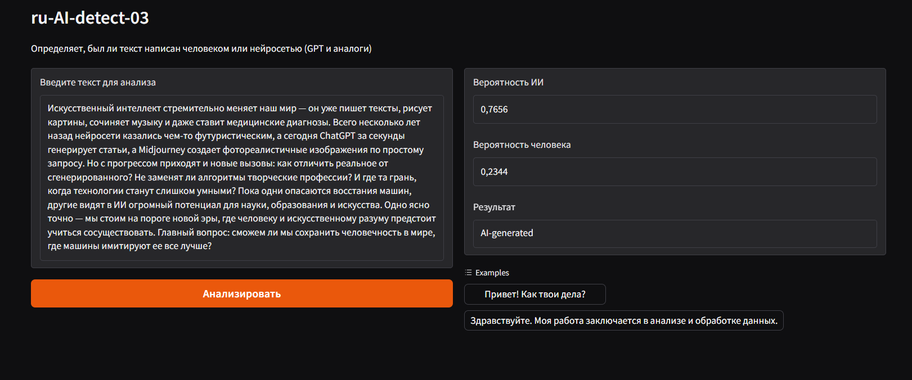

# ru-ai-detect
Классификация текстов на определение, является ли он сгенерированным ИИ

# Датасет:
- файл `data.csv`
- датасет состоит из 202 примеров текстов

|     AI |    Human |
|------------|-------------|
| 101 пример | 101 пример |

- В датасете столбец `label` отвечает за источник текста, где `0` - Human, а `1` - AI

- Тексты написанные ИИ с меткой  `1` были взяты(сгенерированны) в ChatGPT-4o, ChatGPT-o1, ChatGPT-o3-mini-hight, GigaChat 2Pro, GigaChat 2Max, DeepSeek

# Модель
- Обученная модель сохранена в `ru-AI-detect-03.pt`

| Компонент модели          | Количество параметров | Формула расчета                     | Описание                          |
|---------------------------|-----------------------|-------------------------------------|-----------------------------------|
| **BERT-base (rubert)**     | ~177,000,000          | Стандартный размер BERT-base        | Основной языковой слой            |
| **Conv1d**                | 147,456               | `(768 * 64 * 3) + 64`               | 3 ядра, 64 выходных канала        |
| **LSTM**                  | 198,656               | `4 * [(64 + 128) * 128 + 128*2]`    | bidirectional LSTM                |
| **MultiheadAttention**    | 2,359,296             | `4 * (768*768 + 768*2)`             | 4 attention heads                 |
| **Классификатор**         | 262,656               | `(1024*256 + 256) + (256*1 + 1)`    | 2 линейных слоя                   |
| **Итого**                 | 180,828,737          | -                                   | 98% параметров в BERT             |

## Архитектура модели (LLMDetector)
Модель использует мультимодальный подход, сочетая:

1. `BERT` для семантического анализа,

2. `CNN` + `LSTM` для временных паттернов,

3. Статистические признаки текста.

### Статистические признаки
- Извлекаются для каждого текста:

- Перплексия (сложность текста),

- Средняя длина предложения,

- Доля уникальных слов,

- Доля существительных/глаголов,

- Энтропия регистра букв,

- Доля пунктуации, цифр, стоп-слов,

- Общая длина текста.

# Обучение
- Обучение на _Nvidia 4050RTX 6Gb_ заняло _4 минуиты_
### Результаты
- Лучшая точность на обучающих данных: 0.9268
# ВАЖНО!
- Модель имеет ограничесние длинны в 512 токенов! Для оптимального обучения желательно разбивать текст на чанки при обучениие и инференсе!
- Пример c чанками: 1000 токенов → 2 блока (512 + 488 токенов).
# Инференс
- поднятие локального Gardio сервиса через `tun.py`

## Пример отчета с статистическими признаками:

